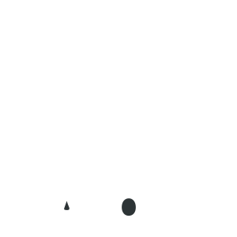

    
      
    
    
    
    
     
    <b>OctoTouch is a touchscreen interface for OctoPrint that was designed with Material Design principles in mind.</b>
     

## Contributing

See [CONTRIBUTING.md](https://github.com/acvigue/OctoTouch/blob/master/CONTRIBUTING.md).

## License

The project is licensed under the GNU General Public License Version 3. [More Information](https://github.com/acvigue/OctoTouch/blob/master/LICENSE.md).

## Attribution
This project was _heavily_ inspired by [OctoDash](https://github.com/UnchartedBull/OctoDash)
Logo icon: [Octopus](https://thenounproject.com/search/?q=octopus&i=593073) by Alice Noir from the Noun Project.